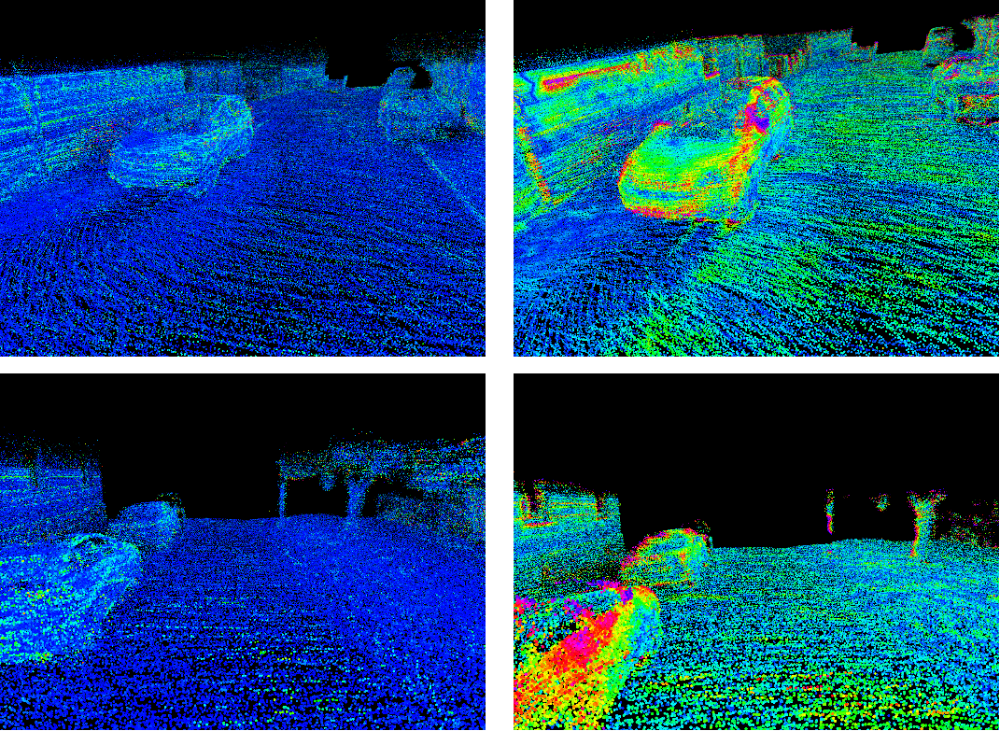

# Semantic Aware Map Metrics

This is the repository of the paper Reconstruction of 3D Semantic Map and Its Quality Estimation.

Here are several tools for calculating quality metrics to reconstruct 3D surface maps with/without semantics described in the paper. There are also several scripts for visualizing map quality.

Here is an example comparison of the quality of two different maps in the same places. The image shows the point clouds taken as GT points, colored according to the reconstruction error-the distance to the nearest point of the reconstructed map. Here, blue (0,0,255) stands for 0 error, and red (255,0,0) for an error of 20 cm.

More details, requirements and HOW-TO will be available soon
